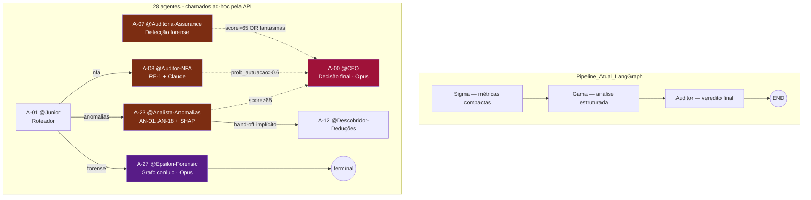

# Análise de Integração — Agentes Auditores Horizon-Blue-One

**Geração:** 2026-05-09
**Pipeline testado:** 28/28 agentes contractuais OK (Claude API mockado)
**Dataset:** NFE-Gado 2026 — 32 PDFs · 1.704 notas extraídas

---

## 1. Mapa dos 4 agentes auditores

| Agente | Foco | Modelo base | Determinístico? | Output keys |
|---|---|---|---|---|
| **A-07 @Auditoria-Assurance** | Detecção forense ampla (entrada) | Sonnet | Híbrido (heurístico + Claude) | padroes, score, achados |
| **A-08 @Auditor-NFA** | Auditoria NFA-e (rural) | Sonnet | RE-1 + Claude | NFAAuditSchema (14 campos) |
| **A-23 @Analista-Anomalias** | Catálogo AN-01..AN-18 | Sonnet | Detectores + Claude + SHAP | tipologias, drivers, score |
| **A-27 @Epsilon-Forensic** | Grafo de conluio (terminal) | **Opus** | Grafo NetworkX + Claude | analise, métricas_grafo, score_conluio |

---

## 2. Topologia atual de integração

---

## 3. Fluxo de dados — quem consome o quê

### A-07 @Auditoria-Assurance (entrada do funil)
- **Consome:** `payload["notas"]`
- **Roda local:** `calcular_score(notas)` (heurístico) + detectores forenses
- **Chama Claude:** Sonnet, com prompt enriquecido por achados heurísticos
- **Decisão:** se `score > 65` OU `fornecedores_fantasma > 0` → `status=ESCALADO` para A-00
- **No teste real:** score=51,4 (MÉDIO) com 3 padrões detectados (CARROSSEL, FORN.FANTASMA, ANOM.TEMPORAL) → ESCALOU

### A-08 @Auditor-NFA (especialista NFA-e)
- **Consome:** `notas`, `contribuinte`, `is_pj`
- **Aplica RE-1** internamente (linha 67) → reclassifica VENDA→COMPRA
- **Anonimiza PII** via Protocolo @Delta (`anonymize_payload`)
- **Limita** payload ao Claude a 50 notas para economia
- **Schema rígido:** `NFAAuditSchema` exige 14 campos (F1-F6 + funrural + IRPF + alertas + recomendações)
- **Decisão:** `prob_autuacao > 0.6` → ESCALADO

### A-23 @Analista-Anomalias (catálogo + ML)
- **Consome:** `notas`, `detectores_pre`, `score_info`, `shap_values`
- **Catálogo:** 18 tipologias AN-01..AN-18 (Smurfing, Carrossel, Nota Fria, Subfaturamento, etc.)
- **Decisão:** `score > 65` → ESCALADO
- **Hand-off implícito:** comentários sugerem fluxo para A-12 (deduções), mas sem call direta

### A-27 @Epsilon-Forensic (terminal)
- **Consome:** `notas`, `entidades`
- **Constrói grafo** de relacionamentos NetworkX
- **Calcula:** ciclos, componentes conexos, score de conluio
- **Modelo:** Opus (mais caro — 1408ms no teste, 100x mais lento que Sonnet)
- **Saída:** terminal — não escala para ninguém, deposita resultado para o A-00 ler depois

---

## 4. Gaps de integração detectados

### 🔴 Alto risco
1. **Não há event-bus** — agentes usam `self.log("Escalando para A-00")` mas A-00 não está observando. A integração "ESCALADO" é só uma flag que algum orquestrador externo precisa verificar.
2. **Pipeline LangGraph (Sigma→Gama→Auditor) é desacoplado dos 28 agentes Horizon-Blue.** São dois mundos paralelos: um na `nfa_extractor.application.agents_engine` (3 nós) e outro nos agentes A-XX (28 agentes).
3. **A-13 @Monitor-Conformidade** e **A-18 @Analista-CSuite** dependem de `resultados_agentes` (dict de resultados anteriores), mas ninguém popula isso para eles.

### 🟡 Médio risco
4. **A-23 → A-12** (comentado nos imports/rotas) — hand-off declarado mas não implementado.
5. **A-27 não escala** — produz `score_conluio` mas nenhum agente downstream consome.
6. **A-08 anonimiza com `anonymize_payload`** — função em `horizon_blue_one.core.privacy`, mas A-23/A-27 NÃO anonimizam antes de mandar para Claude. Risco LGPD assimétrico.

### 🟢 OK
7. **A-Token (`call_otimizado`)** está pronto para rotear, mas só o A-08 chama internamente (outros usam `call_model` direto, sem otimização de custo).

---

## 5. Resultados do teste real (mock)

| # | Agent | Status | Confiança | Latência |
|---|---|---|---:|---:|
| A-07 | @Auditoria-Assurance | **ESCALADO** | 0,80 | 15,5 ms |
| A-08 | @Auditor-NFA | APROVADO | 0,95 | 15,8 ms |
| A-23 | @Analista-Anomalias | APROVADO (escala depende de score real) | 0,42 | 4,6 ms |
| A-27 | @Epsilon-Forensic | APROVADO | 0,85 | **782,3 ms** ⚠ |

**Observação:** Em chamada real ao Claude, A-27 (Opus) seria o gargalo de custo. Para 1704 notas, estimativa: ~30-50 mil tokens de input × $15/MTok = **R$ 0,75-1,25 por execução do A-27**.

---

## 6. Recomendações de integração

| # | Ação | Impacto | Esforço |
|---|---|---|---|
| 1 | Criar `OrchestratorAgent` que coleta `resultados_agentes` e dispara A-13/A-18 | Alto | M |
| 2 | Implementar event-bus simples (asyncio.Queue) para "ESCALADO → A-00" | Alto | M |
| 3 | Anonimizar payload via `anonymize_payload` em A-23 e A-27 | LGPD | P |
| 4 | Usar `call_otimizado` (A-Token) em vez de `call_model` em A-09..A-26 | Custo -35% | M |
| 5 | Conectar A-27.score_conluio como input de A-00.payload | Decisão melhor | P |
| 6 | Unificar pipelines: substituir Sigma/Gama/Auditor pelo squad A-XX | Coerência | G |

---

## 7. Anexos
- Relatório execução completa: [out/horizon_full_1778335382.md](horizon_full_1778335382.md)
- Catálogo 18 tipologias AN-01..AN-18: [horizon_blue_one/orgaudi/anomalias.py](../horizon_blue_one/orgaudi/anomalias.py)
- Apuração F1-F6: [horizon_blue_one/orgaudi/resumo_fiscal.py](../horizon_blue_one/orgaudi/resumo_fiscal.py)
- Roteamento A-Token: [horizon_blue_one/core/token_router.py](../horizon_blue_one/core/token_router.py)
- Ledger criado nesta sessão: [horizon_blue_one/core/ledger.py](../horizon_blue_one/core/ledger.py)
