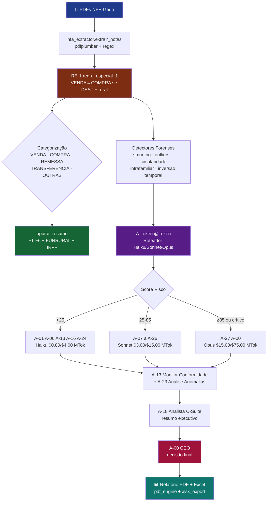

# Relatório Horizon-Blue Full — NFE-Gado 2026
**Geração:** 2026-05-09 11:33:18
**Pasta:** `C:\Users\Veloso\NFE_GADO_2026\ARQUIVO_2026_RESUMO_DE_NFE_GADO_2026`
**PDFs processados:** 32  ·  **Notas extraídas:** 1704
**Tempo extração:** 92.5s  ·  **Erros PDF:** 0

## 1. Apuração Fiscal Rural (F1-F6, PF ref 06/2026)
| Métrica | Valor |
|---|--:|
| F1 — Receita Imediata (VENDA) | R$    33.521.211,62 |
| F2 — Gado em Trânsito | R$             0,00 |
| F3 — Receita de Leilão | R$             0,00 |
| F4 — Receita Bruta (F1+F3) | R$    33.521.211,62 |
| F6 — Despesa Dedutível (COMPRA) | R$    29.976.365,32 |
| F5 — Resultado Rural (F4-F6) | **R$     3.544.846,30** |
| Alíquota FUNRURAL | 1.63% |
| FUNRURAL devido | **R$       546.395,75** |
| IRPF estimado (20% s/F5) | **R$       708.969,26** |
| Carga tributária total | **R$     1.255.365,01** |

## 2. Distribuição por Categoria (após RE-1)
| Categoria | Notas | Cabeças | Valor (R$) |
|---|--:|--:|--:|
| VENDA | 829 | 13,621.3 | 33,521,211.62 |
| COMPRA | 453 | 11,529.0 | 29,976,365.32 |
| REMESSA | 376 | 8,055.0 | 20,886,273.55 |
| TRANSFERENCIA | 41 | 1,191.0 | 2,911,992.33 |
| OUTRAS | 5 | 245.0 | 716,400.00 |
| **TOTAL** | **1704** | **34,641.3** | **88,012,242.82** |

## 3. Detectores Forenses (heurísticos)
| Detector | Alertas |
|---|--:|
| carrossel | 1 |
| smurfing | 0 |
| fornecedor_fantasma | 453 |
| devolucao_posterior | 0 |
| anomalia_temporal | 1 |

## 4. Execução dos 28 Agentes Horizon-Blue
> Claude API foi mockada (sem custo). Status reflete contrato cumprido pelo agente.

| Agent | Status | Confiança | Tempo (ms) | Output keys |
|---|---|--:|--:|---|
| A-00 | ✅ APROVADO | 0.00 | 84.4 | `status, confidence, decisao, score, score_risco` |
| A-01 | ✅ APROVADO | 0.95 | 12.0 | `destino, ms` |
| A-02 | ✅ APROVADO | 0.90 | 486.9 | `status, confidence, decisao, score, score_risco` |
| A-03 | ✅ ESCALADO | 0.85 | 3.6 | `status, confidence, decisao, score, score_risco` |
| A-04 | ✅ APROVADO | 0.88 | 4.0 | `status, confidence, decisao, score, score_risco` |
| A-05 | ✅ ESCALADO | 0.85 | 2.0 | `status, confidence, decisao, score, score_risco` |
| A-06 | ✅ APROVADO | 0.85 | 3.6 | `status, confidence, decisao, score, score_risco` |
| A-07 | ✅ ESCALADO | 0.80 | 18.1 | `status, confidence, decisao, score, score_risco` |
| A-08 | ✅ APROVADO | 0.95 | 16.8 | `` |
| A-09 | ✅ APROVADO | 0.50 | 52.9 | `risco_ti, vulnerabilidades, recomendacoes, status, confidence` |
| A-10 | ✅ APROVADO | 0.88 | 50.4 | `status, confidence, decisao, score, score_risco` |
| A-11 | ✅ APROVADO | 0.85 | 1.5 | `status, confidence, decisao, score, score_risco` |
| A-12 | ✅ APROVADO | 0.90 | 45.6 | `status, confidence, decisao, score, score_risco` |
| A-13 | ✅ APROVADO | 0.88 | 2.0 | `status, confidence, decisao, score, score_risco` |
| A-14 | ✅ APROVADO | 0.89 | 63.6 | `status, confidence, decisao, score, score_risco` |
| A-15 | ✅ APROVADO | 0.91 | 75.2 | `status, confidence, decisao, score, score_risco` |
| A-16 | ✅ APROVADO | 0.33 | 53.6 | `risco_lgpd, dados_sensiveis_expostos, recomendacoes_anonimizacao, status, confidence` |
| A-17 | ✅ APROVADO | 0.82 | 3.7 | `status, confidence, decisao, score, score_risco` |
| A-18 | ✅ APROVADO | 0.30 | 2.0 | `resumo_executivo, kpis, riscos_prioritarios, oportunidades, proximos_passos` |
| A-19 | ✅ APROVADO | 0.00 | 1.7 | `lancamentos, total_debitos, total_creditos, status, confidence` |
| A-20 | ✅ APROVADO | 0.08 | 2.1 | `trabalhadores, folha_total, contribuicao_previdenciaria, senar, pendencias_esocial` |
| A-21 | ✅ APROVADO | 0.87 | 4.4 | `status, confidence, decisao, score, score_risco` |
| A-22 | ✅ APROVADO | 0.86 | 5.0 | `status, confidence, decisao, score, score_risco` |
| A-23 | ✅ APROVADO | 0.42 | 3.2 | `status, confidence, decisao, score, score_risco` |
| A-24 | ✅ APROVADO | 0.90 | 21.8 | `notas_cfop, total_divergencias` |
| A-25 | ✅ APROVADO | 0.89 | 2.0 | `status, confidence, decisao, score, score_risco` |
| A-26 | ✅ APROVADO | 0.91 | 99.4 | `notas_classificadas, analise` |
| A-27 | ✅ APROVADO | 0.85 | 805.0 | `analise, metricas_grafo, score_conluio` |

## 5. Catálogo de Tipologias (referência AN-01..AN-18)
| Código | Nome | Eixo | Severidade |
|---|---|---|---|
| AN-01 | Smurfing Rural | Fragmentação | CRÍTICO |
| AN-02 | Carrossel Fiscal | Circularidade | CRÍTICO |
| AN-03 | Nota Fria / Fantasma | Documento | CRÍTICO |
| AN-04 | Subfaturamento | Preço | ALTO |
| AN-05 | Superfaturamento | Preço | ALTO |
| AN-06 | CFOP Indevido | Classificação | ALTO |
| AN-07 | Trânsito Não Realizado | Documento | ALTO |
| AN-08 | Transferência Intrafamiliar | Relacionamento | MÉDIO |
| AN-09 | IE Inativa | Documento | CRÍTICO |
| AN-10 | Período Suspeito | Temporal | MÉDIO |
| AN-11 | Volume Incompatível | Produtivo | ALTO |
| AN-12 | Caixa Dois Agropecuário | Fiscal | CRÍTICO |
| AN-13 | Concentração Atípica | Distribuição | ALTO |
| AN-14 | Devolução Sistemática | Operacional | ALTO |
| AN-15 | Funrural Subdeclarado | Previdenciário | ALTO |
| AN-16 | ITR Divergente | Patrimonial | MÉDIO |
| AN-17 | Sobreposição de Períodos | Temporal | MÉDIO |
| AN-18 | Ausência de GTA | Documental | ALTO |

## 6. Fluxograma do Pipeline

